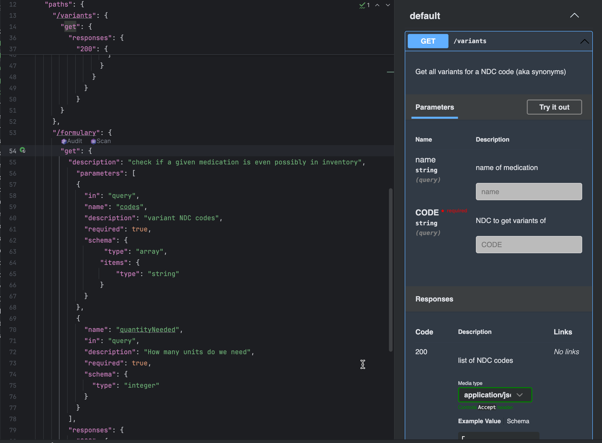
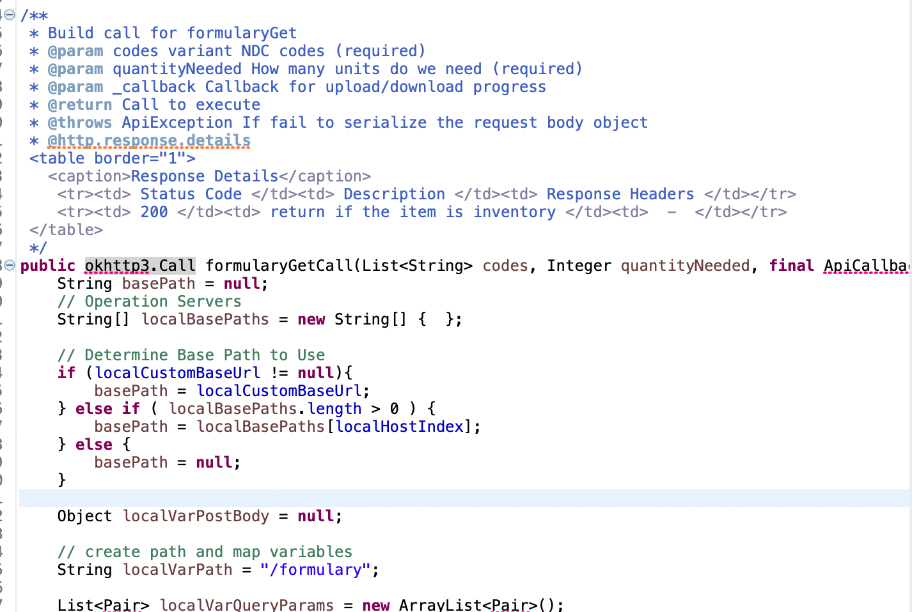
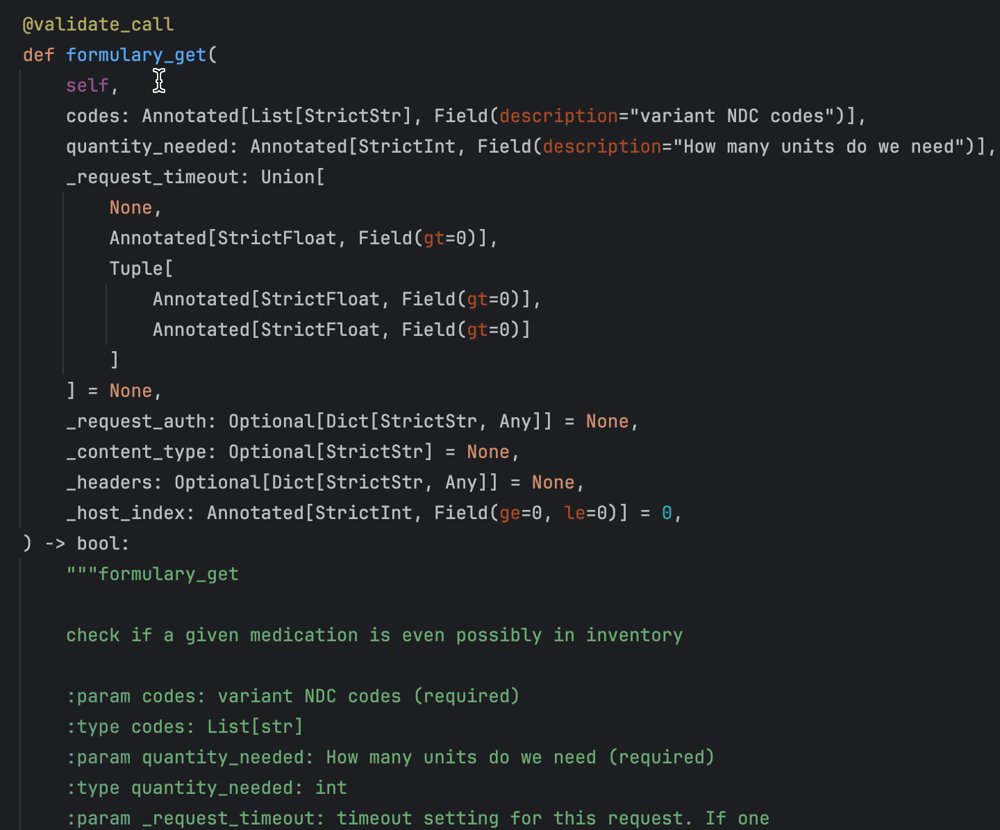
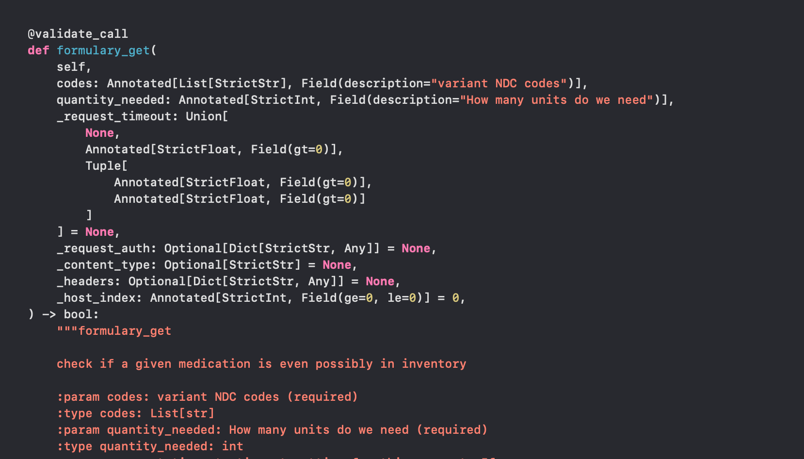

# Collaborating around an API

This recipe is a bit more complex but worth spending a few minutes if it is a recipe you need, because this is a solved
problem.

The problem: you have an application you are building which is a webservice to share data with some other application. This could
be exposing say a database table to some other application, that can't ingest directly, or needs preprocessing. This is an extremely common task.
But your amazing API for your application may consist of many calls with many fields, which have data to/from, and explaining and documenting all that
is a pain, and what if you need to change your api, others who are consuming it are now broken. Even worse what if you wrote your server in
python, but one of the consumers of your API is an iPad application running Swift. Right you can see the support load for your
api is getting big fast. But good news you don't need to figure out the mechanism because industry has the same problem and solved it.

## OpenAPI
For those of us who have been in the software development world, we have lived this problem and been bitten and so the industry created a tool
formerly called swagger, now called OpenAPI, which makes a lot of this better. here is the concept (don't worry we will get to a quick
recipe but it needs a fwe seconds of explanation as to _why_). OpenAPI has a workflow as follows:
1. Design your API before writing any code (i.e. figure out what it needs to do and how) this will create an OpenAPI file
2. Your design file contains the specification of each call and the data it will consume/produce
3. Your development environment can take this file and build your code for you!!
   a. When you do this you get to pick, are you building the server side or the client side
4. Your code now matches this, so let's use a real example for our recipe

## Recipe
For our recipe our example application is going to do only a couple of things, because a full API spec can be huge. Now remember this is an example and I
am deliberately picking a simplistic task that isn't something actually worth doing. we will skip things like authentication, etc. The project I am going to
use as our example recipe is going to pull medications from a table that holds our pharmacy actual inventory (i.e. what is physically in our building or at least should be)
to notify doctors if they are writing a formulary or non-formulary item (this is trickier than it sounds for a reason that will show later)
We are going to ignore some actual logic as to how data would be gotten (or even if it could, just pretend)

### Tasks:
1. Get the medication the doctor is writing for (by NDC code)
2. Take that NDC and get all the "synonym" NDCs for all the manufacturers of that medication
3. Check if _any_ of those NDCs are in inventory and return the number on hand in case that's important

So those 4 tasks are pretty simple data wise and let's flesh that out slightly (remember we are in the design phase so no code yet, we are now going to actually define the web endpoints).
1.  /allvariants
    POST
    data: ```{"NDC": "45678954678", "name": "Atorvastatin 40mg"}```
    response: 200, 400, 500
    Returns: ``` [45675675678, 567567845, 983428347, 57484943] ```
2.  /inventory
    GET
    data: ```{"NDC": "45678954678", "name": "Atorvastatin 40mg"}```
    response: 200, 400, 500
    Returns: ``` True or False ```
3.  /inventory
    POST
    data: ``` [45675675678, 567567845, 983428347, 57484943] ```
    response: 200, 400, 500
    returns: ```342```

Alright, while the logic of this application is somewhat clunky and could be simplified greatly, that's not the point here.
Now steps 1 and 2 are where the challenge in the realworld of this, because Athena uses a NDC code for a drug, so when you prescribe
Atorvastatin 40mg, the system is actually selecting a specific vendor's atorvastatin 40mg, say Merck's tablet, and that has 
a different NDC than Pfizer's. Luckily the NLM (National Library of Medicine) has RxNorm which can map NDC codes into an ontology
that lets you then take the concept of atorvastatin 40mg and ask for all NDC codes that belong to that concept.

So how would that look in OpenAPI format, surprisingly like the steps above. Yes there is a little more detail but basically similar.

The file is a [json file as seen here](glfhc_api.json). As you can see in this screen shot in my IDE (pycharm) the openAPI plugin
actually live interprets this and makes it live testable in the side panel.



### Generating client code (I could have also generated server code with different command options)
So now we can generate code from this file above (for example this is in Java 21):

_Ignore the import errors in this code, I didn't set up a full Java project as en example here so it doesn't have the server libraries and unlike Python, Java cares._

Same OpenAPI file into Python 3.12


Same OpenAPI file into Swift 6


## How to generate the code
You will need to [install the OpenApi generator tool](https://github.com/OpenAPITools/openapi-generator?tab=readme-ov-file#1---installation) with install instructions
for your OS. then something like this:

### Generating Language Code
 ```openapi-generator generate -i /Users/henry/myproject/glfhc_api.json -g java -o /Users/henry/eclipse-workspace/testing/src/com/glfhc/server/```

The key in that is the **-g** tag followed by a language (as you can see there are a staggering number of them):

- ada
- ada-server
- android
- apache2
- apex
- asciidoc
- aspnet-fastendpoints
- aspnetcore
- avro-schema
- bash
- crystal
- c
- clojure
- cwiki
- cpp-qt-client
- cpp-qt-qhttpengine-server
- cpp-pistache-server
- cpp-restbed-server
- cpp-restbed-server-deprecated
- cpp-restsdk
- cpp-tiny
- cpp-tizen
- cpp-ue4
- csharp
- csharp-functions
- dart
- dart-dio
- eiffel
- elixir
- elm
- erlang-client
- erlang-proper
- erlang-server
- erlang-server-deprecated
- fsharp-functions
- fsharp-giraffe-server
- gdscript
- go
- go-echo-server
- go-server
- go-gin-server
- graphql-schema
- graphql-nodejs-express-server
- groovy
- kotlin
- kotlin-server
- kotlin-spring
- kotlin-vertx
- kotlin-wiremock
- ktorm-schema
- haskell-http-client
- haskell
- haskell-yesod
- java
- jaxrs-cxf-client
- java-helidon-client
- java-helidon-server
- java-inflector
- java-micronaut-client
- java-micronaut-server
- java-msf4j
- java-pkmst
- java-play-framework
- java-undertow-server
- java-vertx
- java-vertx-web
- java-camel
- jaxrs-cxf
- jaxrs-cxf-extended
- jaxrs-cxf-cdi
- jaxrs-jersey
- jaxrs-resteasy
- jaxrs-resteasy-eap
- jaxrs-spec
- javascript
- javascript-apollo-deprecated
- javascript-flowtyped
- javascript-closure-angular
- java-wiremock
- jetbrains-http-client
- jmeter
- julia-client
- julia-server
- k6
- lua
- markdown
- java-microprofile
- mysql-schema
- postgresql-schema
- n4js
- nim
- nodejs-express-server
- objc
- ocaml
- openapi
- openapi-yaml
- plantuml
- perl
- php
- php-flight
- php-nextgen
- php-lumen
- php-slim4
- php-symfony
- php-mezzio-ph
- php-dt
- php-laravel
- postman-collection
- powershell
- protobuf-schema
- python
- python-pydantic-v1
- python-fastapi
- python-flask
- python-aiohttp
- python-blueplanet
- r
- ruby
- ruby-on-rails
- ruby-sinatra
- rust-axum
- rust
- rust-server
- scalatra
- scala-akka
- scala-cask
- scala-pekko
- scala-akka-http-server
- scala-finch
- scala-gatling
- scala-http4s
- scala-http4s-server
- scala-lagom-server
- scala-play-server
- scala-sttp
- scala-sttp4
- scalaz
- spring
- dynamic-html
- html
- html2
- swift5
- swift6
- swift-combine
- typescript
- typescript-angular
- typescript-aurelia
- typescript-axios
- typescript-fetch
- typescript-inversify
- typescript-jquery
- typescript-nestjs
- typescript-node
- typescript-redux-query
- typescript-rxjs
- wsdl-schema
- xojo-client
- zapier

