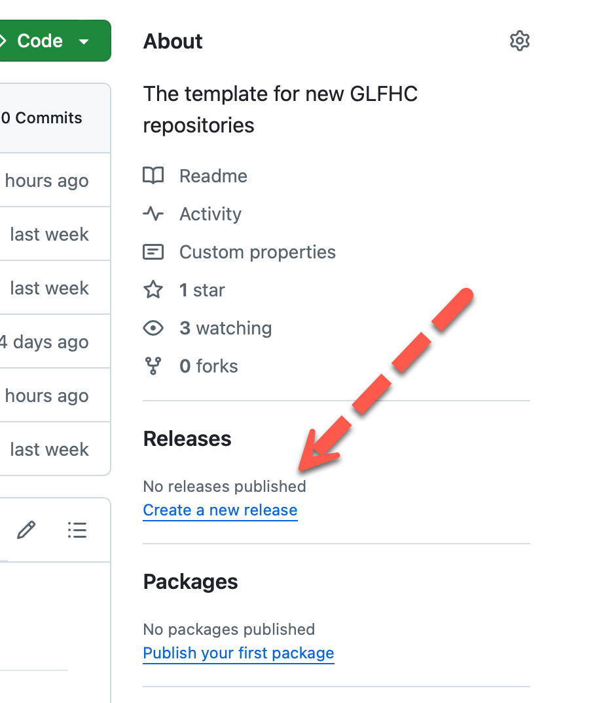

-   [Managing Software
    Releases](#managing-software-releases){#toc-managing-software-releases}
    -   [Why Use Releases](#why-use-releases){#toc-why-use-releases}
    -   [How are Releases
        Named?](#how-are-releases-named){#toc-how-are-releases-named}
    -   [Creating a Release
        Tag](#creating-a-release-tag){#toc-creating-a-release-tag}
    -   [Best Practice for Release
        Names](#best-practice-for-release-names){#toc-best-practice-for-release-names}
    -   [Getting the release version into your
        code](#getting-the-release-version-into-your-code){#toc-getting-the-release-version-into-your-code}

# Managing Software Releases

## Why Use Releases

While GitHub has a continuous change management database that lets you
go back through every change to any point in the project\'s history,
that is harder for people to understand what that state means. In
general humans do much better with a named point in time, which in the
software world we generally call a release. GitHub by convention
doesn\'t care about human named releases, but has functions to package a
specifc state with a name that it will allow to be downloaded by name in
a compressed file (zip or tar).

## How are Releases Named?

Releases use a GitHub concept called a tag, which basically is just a
text snippet that is formatted as \"V\" followed by a number. There is
no requirement to use releases, but they are handy for project
management. Additionally, it is very important to know that by
convention we use the Vx.x format, but tags can be **any arbitrary
text**, like Apple uses for MacOS using names of California locations.

## Creating a Release Tag

Tags are slightly confusing in Git as they are outside of your code
space, so unlike most changes like the yaml files for
[automation](automation.md) tags are seperately applied to a repository.
You can create tags and commit them into the repository. However, for
convienence GitHub in the webview supports directly creating a release,
or you can independently create the tags:



Once you create a release, there are options that define the release.
Releases can be production or pre-releases (alphas and betas), and while
it seems like something large software companies do, but chang
management is a major risk mitigator in enterprise software deployment.
You see in the screen below you can create a title, along with
descriptions and create release notes to go along with the release. Note
at the top this same screen you can switch to creating a tag since those
are synonymous. By default, when you create the release it will
automatically be promoted to the most-recent release.

## Best Practice for Release Names

The best practice for GitHub release names is to use Symantic Versioning
([SemVar](https://semver.org)), meaning a tag in this format:
`V<version>.<Subversion>.<patch>` Using this format will cause GitHub to
numerically order them (helpful in the next step), the order does permit
gaps, in case you skip a sub version (e.g. going from 1.2.0 to 1.4.0
will still sort properly)

## Getting the release version into your code

One handy feature is pulling the release number into your code (for
display on an about-box or webpage). This use-case makes more sense in
the setting of an application. For this it is easiest to use the command
line Git tool to pull the version into a text file:

The command line git tooling will produce a tag list as follows:

`git for-each-ref --sort=creatordate --format '%(refname)' refs/tags | tail -1`

which will produce:

``` text
refs/tags/1.0.0-alpha
```

If you pushed this into a file such as a shell statement like this:

`git for-each-ref --sort=creatordate --format '%(refname:strip=2)' refs/tags | tail -1 > version.txt`

will produce a file like:

``` text
1.0.0-alpha
```

You could read this text in and put it on a screen in your application.
