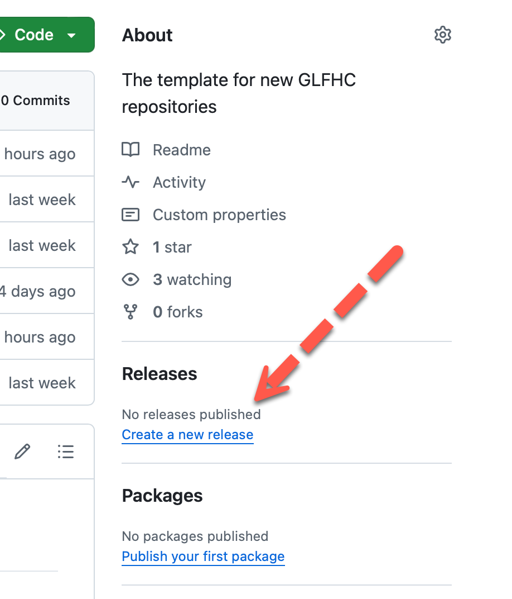

# Managing Software Releases

## Why Use Releases

While GitHub has a continuous change management database that lets you go back through every change to any point in the
project's history, that is harder for people to understand what that state means.
In general humans do much better with a named point in time, which in the software world we generally call a release.
GitHub by convention
doesn't care about human named releases, but has functions to package a specifc state with a name that it will allow to
be downloaded by name in a compressed file (zip or tar).

## How are Releases Named?

Releases use a GitHub concept called a tag, which basically is just a text snippet that is formatted as "V" followed by
a number. There is no requirement to use releases, but they are handy for project management. Additionally, it is very
important to know that by convention we use the Vx.x format, but tags can be **any arbitrary text**, like Apple uses for
MacOS using names of California locations.

## Creating a Release Tag

Tags are slightly confusing in Git as they are outside of your code space, so unlike most changes like the yaml files
for [automation](automation.md) tags are seperately applied to a repository.
You can create tags and commit them into the repository. However, for convienence GitHub in the webview supports
directly
creating a release, or you can independently create the tags:



Once you create a release, there are options that define the release. Releases can be production or pre-releases (alphas
and betas), and while it seems like something large software companies do, but chang management is a major risk
mitigator in enterprise software deployment. You see in the screen below you can create a title, along with descriptions
and create release notes to go along with the release. Note at the top this same screen you can switch to creating a tag
since those are synonymous. By default, when you create the release it will automatically be promoted to the most-recent
release.

## Best Practice for Release Names

The best practice for GitHub release names is to use Symantic Versioning ([SemVar](https://semver.org)), meaning a tag
in this format:
`V<version>.<Subversion>.<patch>` Using this format will cause GitHub to numerically order them (helpful in the next
step), the order does
permit gaps, in case you skip a sub version (e.g. going from 1.2.0 to 1.4.0 will still sort properly)

## Getting the release version into your code

One handy feature is pulling the release number into your code (for display on an about-box or webpage). This use-case
makes more sense in the setting of an application. For this it is easiest to use the command line Git tool to pull the
version into a text file:

The command line git tooling will produce a tag list as follows:

`git for-each-ref --sort=creatordate --format '%(refname)' refs/tags | tail -1`

which will produce:
```text
refs/tags/1.0.0-alpha
```
If you pushed this into a file such as a shell statement like this:

`git for-each-ref --sort=creatordate --format '%(refname:strip=2)' refs/tags | tail -1 > version.txt`

will produce a file like:
```text
1.0.0-alpha
```

You could read this text in and put it on a screen in your application.