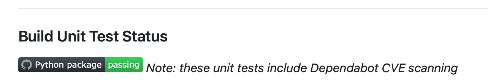
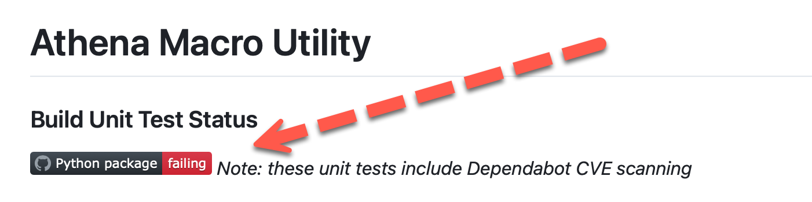
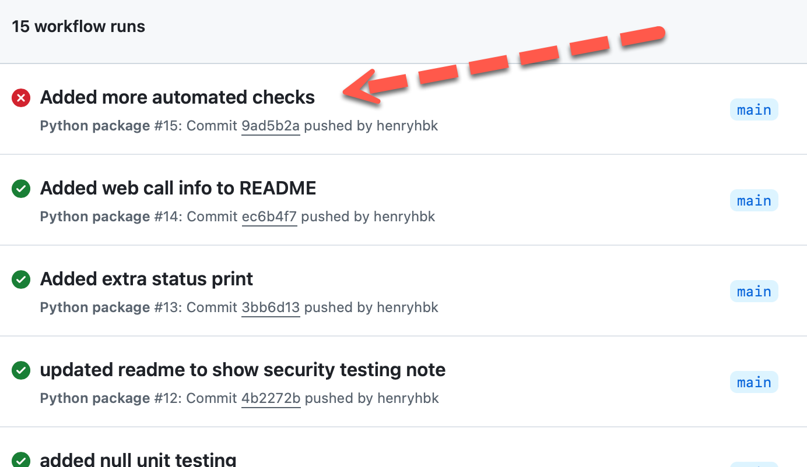
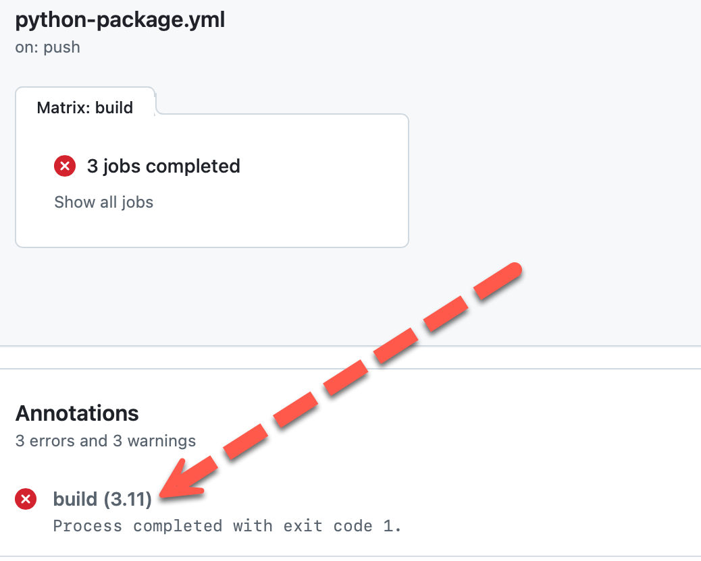
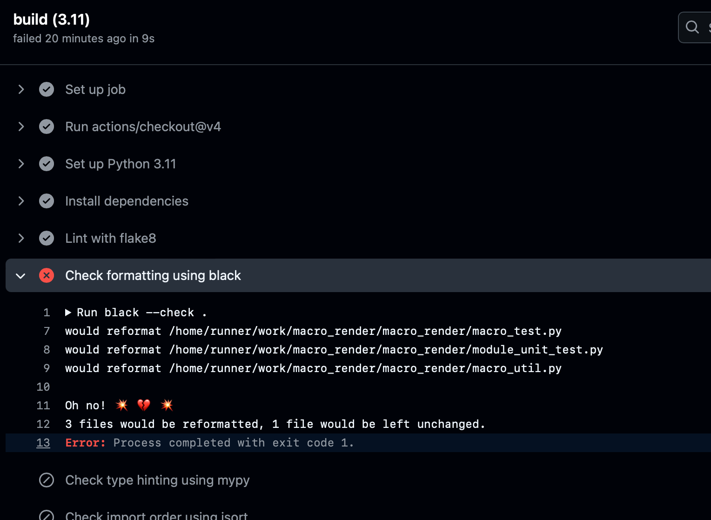
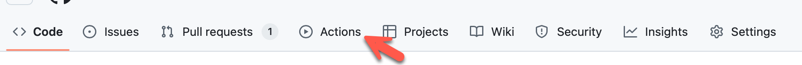

# Using GitHub Automation

## Automating busy work

GitHub has lots of automatic functions built in that are designed to perform repetitive tasks for the user.
There are over 13,000 automation functions in GitHub. You will find them under GitHub Actions. Of course many of
them solve problems that only large software projects have. The majority you want are under the "CI/CD group" (Continuous Integration/Continuous Deployment)

Example functions that are useful in the GLFHC environment
are:

- Security scanning ([Dependabot GitHub vulnerability scanner](https://github.com/dependabot)
- Build validation (Build Action - example below uses the **Python Package** Action)
- Automated unit testing (UnitTest action)
- Conection to other APIs (such as support ticket systems)
- Key Leakage scanning
- Automated Container Deployment (Docker, etc.)

These functions are built into GitHub, and can do things like show the status of a build/unit test in the header as in
the image below



Here is a failure (deliberate)


#### Diagnosing Failures
Note: "failing" doesn't mean you have a terrible programmer, anything other than "success" is considered a fail to GitHub (there is no "warning").

To diagnose what happened, go to the actions tab, and look at the runs (if you just did it, there might only be one run)



Clicking on the red one will bring up that run's details. In the details you see the tasks you configured in your script (see below, in this case since I lumped everything under "build")
I only see one failure:



Under build, you will see the steps that ran and what stopped the test (no I don't know why it is showing in dark theme)



What we see here is the Black library didn't like some formatting in 3 of my modules (ironically including my automated unit tests, sigh...)

In the YAML file we build below, it is very important to use clear names for each step in the run, since that is what is shown here.
There are some oddities in black which very strictly enforces 


The automation available in the Actions tab of your repository takes you to the actions available for the project.
Actions are _configured_, not _programmed_ (although your code obviously needs to be designed for the action.
**For example calling the unit testing action without unittests is pointless**)

## Adding an Action to your Repository

Let's take the simple case (ha) of unittesting in a python application. Unit
Tests are typically part of a programming language that have a standard
interface callable by the compiler to perform basic testing and validation
(checks for basic regression errors like calling a function with the wrong
argument type). Unit Tests mostly all obey the interface from Java's Junit
library (Python's unit testing library does as well). Unit Tests can be manually
executed in your IDE or executed on commit to GitHub.

For our example, when code is put into the Main branch (either directly or via a Pull Request (merge)) GitHub will run the pacakge unit
tests which will test a test data set against the code to make sure all expected output happens. In addition, it will
test this against a list of versions of python to make sure it is compatible. The script is controlled via a [YAML](https://en.wikipedia.org/wiki/YAML)
file. Note this script is what produces the status badge at the top. The unit tests also execute the [Dependabot GitHub
vulnerability scanner](https://github.com/dependabot), so passing also means no CVEs were noted in the dependencies.

## How do we add an action
In the repository main screen on the top bar, select the action button:



Find the action you wish to add in the catalog that shows what actions are available. Many don't apply in our environment.
make sure the version you select applies, for instance there are several python validators, it is unlikely you are creating 
a python _application_ (that is a native application for instance to run on Windows/MacOS/Linux as a standalone desktop app (with menubars, windows, etc), you probably built a python _package_).
When you find the python package in your dev tooling, select configure, and you will see a YAML script to configure the workflow (see below)

## YAML file configuring an action
Below we see a YAML file from the [Athena Macro Utility project](https://github.com/GLFHC/macro_render/tree/main), where you
can see the entire _workflow_ in action. This _workflow_ is stored in the _.github/workflows_ folder off the root of your project. 
The YAML file must be in there, which is where github looks for what automation to run.

Details at end
```YAML
# This workflow will install Python dependencies, run tests and lint with a variety of Python versions
# For more information see: https://docs.github.com/en/actions/automating-builds-and-tests/building-and-testing-python

name: Python package

on:
  push:
    branches: [ "main" ]
  pull_request:
    branches: [ "main" ]

jobs:
  build:

    runs-on: ubuntu-latest
    strategy:
      fail-fast: false
      matrix:
        python-version: ["3.9", "3.10", "3.11"]

    steps:
    - uses: actions/checkout@v4
    - name: Set up Python ${{ matrix.python-version }}
      uses: actions/setup-python@v3
      with:
        python-version: ${{ matrix.python-version }}
    - name: Install dependencies
      run: |
        python -m pip install --upgrade pip
        python -m pip install flake8 pytest black mypy isort
        if [ -f requirements.txt ]; then pip install -r requirements.txt; fi
    - name: Check formatting using black
      run: black --force-exclude="test_macro.txt" --check .
    - name: Lint with flake8
      run: |
        # stop the build if there are Python syntax errors or undefined names, ignore to not fight with Black
        flake8 . --count --select=E9,F63,F7,F82 --extend-ignore=E203,E501,E701 --show-source --statistics
        # exit-zero treats all errors as warnings. The GitHub editor is 127 chars wide
        flake8 . --count --exit-zero --max-complexity=10 --max-line-length=127 --statistics
    - name: Check type hinting using mypy
      run: |
           mypy macro_util.py
           mypy macro_test.py
           mypy module_unit_test.py
    - name: Check import order using isort
      run: |
          isort --check-only macro_util.py
          isort --check-only macro_test.py
          isort --check-only module_unit_test.py
    - name: Test with UnitTest
      run: |
        python -m unittest discover -s .
```


Put comments in with "#" characters followed by a space. For those unfamiliar with YAML it is similar to Python in that **whitespace matters**. 
Even worse, is the **hierarchy order** and YAML is case-sensitive. In the file above, top level are denoted by a label with colon for each section. In this case I kept it pretty simple and close to the default.

**name:** is the name you want to call the workflow (you can leave it as the default)

**On:** defines the triggers. In this case a push (sending commit to cloud repository) or pull-request (merge) on the main branch (I don't want to execute this every branch check in, only the main deployable branch. I run these unittests in my IDE on branches.

**jobs:** This is where you tell it what to do when it triggers
- **build:** We are going to run a build (compile). 
- **runs-on:** unless you desperately need something other than basic linux (such as a windows server as you wrote to native functions), select _ubuntu-latest_ which is free, others may incur surcharges.
- **strategy:** Leave this alone, fail-fast is probably what you want
- **matrix:** this is where you decide compatibility of your code with multiple language/OS versions

**Steps:** these are the order of tasks you want the action to run the individual calls to execute the job
- **uses:** these are special action commands to get ready to execute the job. In this case it needs to check out the code from the repo
- **name:** name of this step for logging purposes
- **with:** resources for this execution
- **uses:** This uses as above says to execute every version of python in our matrix
- **name:** name of this step for logging purposes
- **run:** these commands are run to prepare the environment, in this case using pip (the python package manager) to install our requirements (in this example using the requirements.txt file from pipenv)
- **name:** name of this step for logging purposes
- **flake8:** is a python tool for assuring PEP compliance of the code (and giving counts of specific errors)
- **run:** this final run executes the unittests (discover says I want the compiler to find all unittests in the code)

## What happens now
When you check in your code, it will execute that entire workflow after spinning up an Ubuntu virtual machine, configured as above.
When the status finishes to make it apparent you can put a special image link that points to the YAML file above, which is bizarre as a concept
but github patches your request and returns the success/failure badges:

```text

```

If you look in that folder you won't find that svg file, it is sort of created on the fly when the yaml script runs.

which will look like:


## The badge
That badge can indicate the union of all of the Steps in the YAML file. If any fail the total status is failed (a red badge).


How can I make those cool badges like this? It's easy, these are a feature of shields.io. It is written as
a standard tag, but in the case of Markdown we can either make static tags (like this one) or dynamic tags
that are linked to a specific value of a function (like say a build process succeding or failing).

#### Badge Syntax:
```text


formatted as:

```
**Spaces** are indicated by an underscore _

**ColorValue** can either be hex RGB colors or there are names (Background color of the right part (hex, rgb, rgba, hsl, hsla and css named colors supported).
Example: fedcba

### Optional Query parameters:
_style_
Possible values: [flat, flat-square, plastic, for-the-badge, social]

_logo_
Icon slug from [simple-icons](https://simpleicons.org). You can click the icon title on simple-icons to copy the slug or they can be found in the slugs.md file in the simple-icons repository. Further info.
Example: appveyor

_logoColor_
The color of the logo (hex, rgb, rgba, hsl, hsla and css named colors supported). Supported for simple-icons logos but not for custom logos.
Example: violet


## Things to watch out for in Unit Tests
The problem with unit tests is that they give a false sense of security. These are not-exhaustive tests typicall,
and are typically used to catch _oopsies_ that you made breaking something (such as changing a type for a function argument).
However, they can't simulate every scenario. Now a strict language like Java prevents a lot of egrious programming errors 
such as wrong type since that instantly throws a sytax error. Also if you change OSs or CPU type, numbers may change formatsThe few things that unit tests to be effective fail to do,
such as big-endian, etc. Some common unittest errors are:

- use non-representative data (I had a QI tester only put "2" in a integer field for months and we didn't know that we 
were in a 16-bit data structure so 2 always worked, but once an actual client number went in we got a range check error),
and it is recommended to use "fuzzing" and generate a wide set of random inputs (some being invalid - but you can assert an exception in
the test since the exception is the expected result). 
- Don't verify thread safety. Note in python, threading is a major afterthought and so most operations will not need to worry about 
such issues, such as iterrupts. Databases do not suffer this problem (FIFO queue with record locking - e.g. the first guy there 
gets the key to the door, and locks it behind himself until he is done), which is what is known as a semaphore lock. If whatever
system you are using, uses semaphores you need to test for circular dependency locking against that sempahore (in other words)
if function A depends on B's output, which in turn depends on C's output, which depends on A's output. This will of course lock
up in a resource wait state. This can happen either due to a circular chain as above or several things accessing a data element that is 
partly written. Even python can suffer from this type of error, and should be included in your tests. Unless you are using the
threading library in python you probably only need to worry abot variables that depend on external things (such a common disk file),
- The variant of the thread safety problem is split-writes (known as **data tearing**), which is when a data element is wider than
the system bus and to write into memory needs multiple operations to complete the write. Unlike say SqlServer, which would lock the
records until it completes, the network drivers has no such compunction to help you out, and the memory location you are
retrieving could be chaning underneath you, since most bus peripherals (network, disk, etc) can use DMA (Direct Memory Access) meaning they
can write to main memory with a write split to the bus width (e.g. at 384-bit word cannot be writen on a 128-bit bus as a single write) this is true
for your code and for system functions performing IO since the bus is the bus.
- Failing to account for asynchronous reads/writes. When you throw something out the network port, the code reports success that the packet was sent
  (i.e. the driver worked as intended) that did not test whether the data sent was correct or the far end recieved it. So networked
unittests need to account for all of that

Suggested Next: [How to validate SQL code projects](sql_validation.md) using the above
