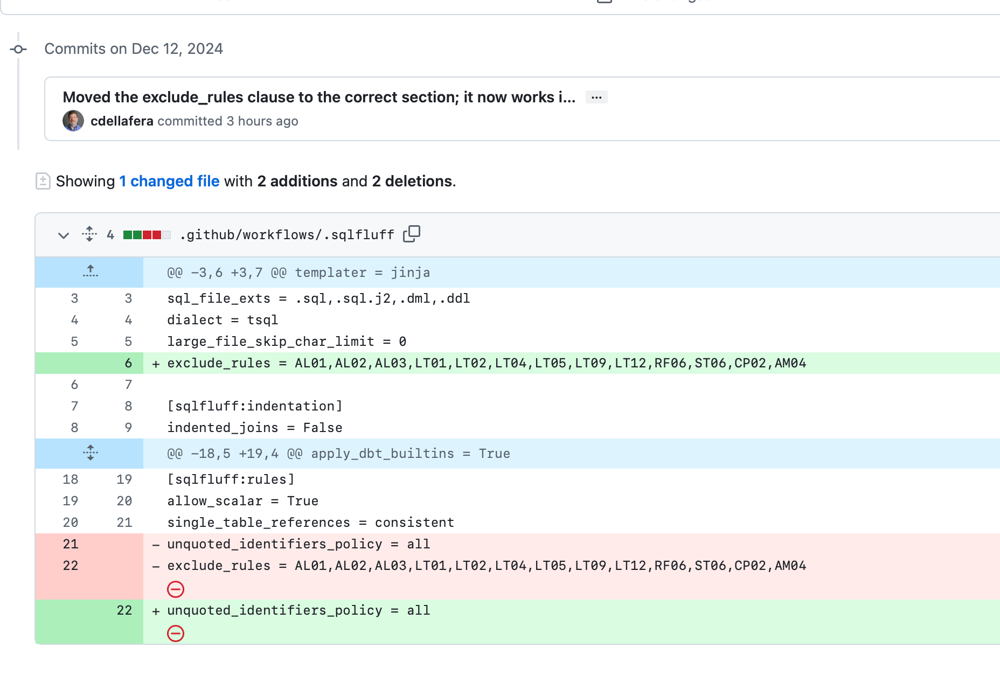

# Sharing a repository

## Adding other contributors to your Repository
As your mother told you, _sharing is caring_! And that is true in GitHub as in life, but it is critical
to understand how GitHub shares repositories.

## Never Share Respository Files Directly
Never, ever simply copy a respository on one machine to another, this will create potential serious errors
in repositories (including _time-travel_ where files seemingly travel through time before they were modified)

## Adding A User
Assuming you are the owner of a repository (or have been granted privileges to administer the repository) adding another 
collaborator is easy. At the top of the repository select _Settings_:

### Collaborators And Teams
Next select _Collaborators And Teams_ on the left:

### User Access Management
Manage the access on this screen

On this screen you see 2 different ways to manage access, first off is via roles, now everyone in the GLFHC Dev groups has 
general **read-only** access to repositories unless you use the idividual access tools below to specify individuals.
For individual access, you can either create a team of users, and then add them to the repository as a single team (very helpful
if a team will be sharing multiple projects), or can use the **Add People** button to add a specific person to the repository.
When you add someone, it is strongly (like seriously!) recommended to use the person's email address within GLFHC or if they are 
added with another email address you need to absolutely make sure it is the same person, allowing access to a non GLFHC person
would permit a signficant security breach. Once you select the person, as you see below, you need to decide on what access
they need to the repository:

### User Privileges

For basic co-developers generally that is "_write_" privs, Maintain is for people who might be doing somewhat higher level 
tasks (such as changing structure or actions of the repository), Admin is essentially root access of the repository, and generally
there should be only one admin in general (or you get clashing of changes potentially) Anyone who has upper level admin access,
such as editing of the GLFHC group in general, can get in to a repository if something gets broken.

### How to work with others (i.e. how merges work in the real world)
This is the most important section in the entire tutorial set. **It's a fair amount of text, but really, really important!** Now that multiple people are on your repository we now need to figure out how to collaborate to actually do work together safely.
Older source code control systems used a public-library model where the active user was "checked out" with the code, and anyone else
had to wait until the active person checked it back in, this falls afoul of the old adage "you can't make a baby in 9 months by impregnating 9 women" because
all the work had to be done in serial fashion. So to work in parallel we need a scheme to permit multiple changes to the same code
to happen at once without overwriting each other.

#### First Step: Branching
When each user is workin on the code, the best mechanism is to create a branch, branches basically mark a point in time, and then let you
make any change you want, without affecting anyone not set to your branch. In general with multiple developers on a repository,
it is a bad idea for everyone to work on the _main_ branch. If you do, you will rapidly run into the "last commit wins" model,
where like a database the last update is what will be persisted. So how does a branch work? When you create a branch you are working on a seperate
internal copy of the entire repository, and the changes only apply to your branch. This is great for experimenting or you are working
simultaneously on code with another person. You can create a branch in either GitHub Desktop or web GitHub, in the desktop (or whatever git client you
are using, you can select the active branch for you). In theory anyone can get access to your branch, but by convention we don't (except in very specific cases).

#### Second Step: Changing in the Branch
When you look at a repository in GitHub Desktop the active branch (you have all the branches on your machine) is displayed top left, and you can swap between them at will (nothing is lost - just remember to save your changes prior to swapping!)

After you are satisfied with your changes to your branch you now need to go to the most important step which is Merging via a _Pull Request_. Confusingly,
a Pull Request is not a fetch, as it sounds, but is a request to pull your branch into main (technically any branch into any other).

#### Final Step: Merging with Pull Request
On the top of the repository you need to create a pull request:

Then select _New Pull Request_ on the top right

If you forgot to make a branch you will something like this:

Which is telling you, you can't merge something into itself (since by defintion there are no differences to itself to merge)
The alternative to a branch is a fork, but unless you are fundamentally changing the entire project, I generally use branches,
however you can compare across forks as well (it's right above that)

Which brings this up:

That will display something like this which is highlighting the changes between the two, and you can either reject or accept these
changes. If there is a conflict (i.e. both branches or both forks made modifications to the same line, you will be prompted to pick one as the survivor):

(green is add, maroon is deleted) Note if you find the view confusing (this is the merged result, select Split on the top right)
In the example above, there are no conflicts, so you can perform the merge, a final safety check is here:

When the merge is complete your main branch now has the changes from the fork pulled back in.

`

## Next
View [Managing Non-Code Files in GitHub](noncode_files.md)
