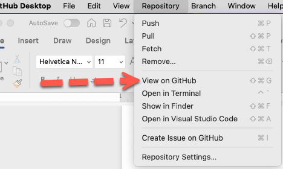
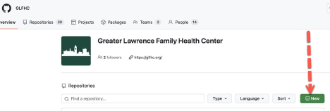
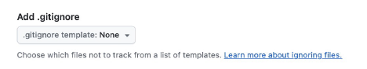

# GLFHC Creating Your First Repo guide

### [Henry Feldman, MD](mailto://hfeldman@glfhc.org)

## Easiest Way to Create a Repo

Not everybody does it this way, but I find it much, much easier to create my repository in the browser and clone, you
can create local and push up, but it’s easy to make a mistake, the reverse is safer. The first thing I do is in GitHub
desktop you can select “view on GitHub” under repository and it will open your browser to your GitHub account. 

You probably want to add your new repository in the GLFHC collection so that is found at: https://github.com/GLFHC. If
you have not been added to be a user, you will only see the title bar and a permissions error message. But assuming it
works, you shoudl see something like this:

There is a “new” button, which will create a new repository. In general do not use spaces or funky characters in the
name of a repository, and please make the name descriptive (and put a short description 1-line in the description
field), so let’s call our repository “test_sql_scripts” (note the repo name must be a legal file name on your computer’s
operating system (so probably no dashes, asterisks or ampersands), as a general rule I always create a “readme.md” file
to tell people about what is in the repo and how to use it (which is how you got here). README files are written in MarkDown,
in fact a specific [github dialect](https://docs.github.com/en/get-started/writing-on-github/getting-started-with-writing-and-formatting-on-github/basic-writing-and-formatting-syntax) of MarkDown (sort of like html, but not).

Additionally, you should select the appropriate _.gitignore_ template for your language (more later) 

## How to use the README.md

You might be wondering why there is a section on how to use the README file, but in git that file is somewhat special. If you
for instance click on the “bulkupdate” repository you will see a long document below banner with the list of files that tells a lot
of technical architecture concepts about the application. Obviously for simple projects there doesn't need to be as extensive
documentation (but who ever complained about overdocumenting code?)

This document is in Markdown format (.md) which is sort of
like html but far enough to need a small explanation). Markdown like any language has dialects and of course 
[GitHub has its own](https://docs.github.com/en/get-started/writing-on-github/getting-started-with-writing-and-formatting-on-github/basic-writing-and-formatting-syntax). That link takes you to the description. 
Without a README (**yes in all caps**) the repository will only have a name
and file list. It is best practice to explain in the readme how to _use_ your code (dependencies, tools, commands, install
tips, etc). You can link to files in the repository in your markdown (say a link to a code file so people can quickly
see something you wish to highlight). If you don’t like hand coding your documents most IDEs have markdown plugins to let
you write in a WYSIWYG environment (the formatting is simple if you look at this file for instance). You can put images in 
markdown like a webpage but the image file needs to be in your repository unless you will be using a web url.

For things like video files, put those outside the repo like on YouTube or Vimeo and link in. Git has a file size limit and it
will break functions in your repository if you exceed this limit.

Once you have written the README.md (honestly write a chunk before you lay your first line of code down). After saving the file, 
you should comit (please write a short comment) it to git (I see you are confused since nothing changed when you refreshed the webpage, because you only comittted
it to your local drive's copy of the database, you need to "**push origin**" to tell it to upload, once that finishes, when you refresh the web page it changed).

## Ignoring Unwanted Files
Anyone who has done any quantity of software development knows the detritus that ends up in the project folders from the 
development process (cached compilations, .ini files, settings, IDE files, etc.) are all things that need to NOT be checked in.
When committing to the repo, you could select only the files you want to the repo, but who has time for that (and believe me you will check in one of these at one point)
you can add file patterns to the .gitignore file, which if you selected an appropriate one when you created the repository 
will prevent certain files from being seen by git. **Important**: once a file is checked in, it cannot be ignored. You can put directory
names in .gitignore and it will ignore all the contents below that. Very important to do this as many of those files are specific
to your machine and will confuse another user's IDE.

## Next
View [Forking and Branching](forking_and_branching.md)

