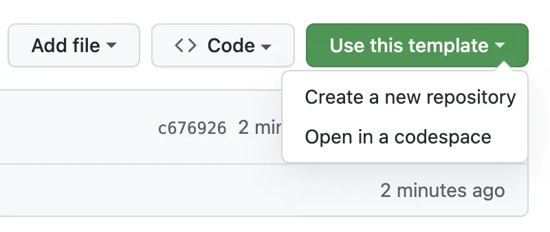

# Working with existing projects

## Background
A frequent occurrence early on at an organization that is adopting GitHub, is that most projects were 
not started within a repository, and you want to add this project to our GitHub instance so the project
is preserved and others can find it (changes tracked, etc.). Depending on your project the basics are below,
find your scenario below:

### Make a git folder
Most people who work routinely with Git choose to have a git folder on their machines where all repositories get cloned to.
Git doesn't care where the repositories go, but for your sanity, I would suggest creating a folder (say in your home folder)
named something like "_gitclones_" (name not important), now when you clone in GitHub Desktop, you can select the gitclones folder
as the destination (it remembers the last, so generally will continue to clone there)

### Single File (likely SQL script for a report)
It seems overkill for a single repository to hold a single file, and it probably is, of course that single file could
be 20,000 lines of code (please never, ever, do that!) so what is the best idea for this? Well while an entire repository
for a single SQL file is overkill, it would be awkward to just dump them all in a single folder and put that into git,
since others would struggle to find things. Far better to create a _team_ level repository (such as "_BI-Reports_"),
and then make a folder for each report inside. Please put a README.md in each folder so that others can understand the purpose
of your script code. If there are helpdesk tickets associated with the script you could put links in the README
so that the entire history is preserved. to use this _(obviously if you don't work on BI Reports, choose a different name scheme)_:
1. clone the team repository to your computer (for this tutorial we will use `BI-Reports`)
2. Go into that repository folder `gitclones/bi-reports` and create a folder for your report (let's say `billing report`)
3. Move the sql file from your existing folder to that folder
4. using a text editor, like NotePad create your [README.md](https://docs.github.com/en/get-started/writing-on-github/getting-started-with-writing-and-formatting-on-github/basic-writing-and-formatting-syntax), using markdown syntax to give a quick description of your script.
5. In GitHub Desktop, put a commit comment (the smaller text field) and select commit, then `push origin`

7. Everyone on the team, will soon get the folder the next time their git client pulls a refresh.

### Many files in a project
A structured project, either in a standard language, such as Python or Java, often has a complex structure depending on the 
type of project, like the required structure in a Java Maven project. This is not a problem,
since GitHub doesn't care particularly what is inside a given repository (there are limits, but it is in the tens of thousands of folders)
In a higher level language project you need make sure there are no specific directories in the code since we will be moving the project
files (like in a config file if you did an absolute path to a resource). Let's call our project _Web-Project_ for purposes here.

There are 2 ways to do this, both are fine, but in my mind, #1 is safer, and since we are tyring to use corporate templates to assure
common tools, templates are on the server (.
#### Server First Method

1. Go onto our [GLFHC GitHub instance](https://github.com/GLFHC/), and at the top under repositories,
select "Repositories" at the top, and then "New Repositories" in the top left, give it a name and brief description, Try to avoid ambiguous names like "my-report" _(note no spaces)_
2. Now once your repository succeeds in creating, now go into it off the repositories list (button at top)
3. Note the ignore template helps you ignore all the detritus left by various languages that nobody else wants in their copy
3. The green button the right marked "clone" will create your local copy (for speed use the "Open in GitHub Desktop" button)

4. Now find your project on your disk and **copy** the folder to the top level of your repository on your disk (note keep the copy until you are sure it works)
5. using a text editor, like NotePad create/edit your [README.md](https://docs.github.com/en/get-started/writing-on-github/getting-started-with-writing-and-formatting-on-github/basic-writing-and-formatting-syntax), using Markdown syntax to give a quick description of your script.
6. In GitHub Desktop, put a commit comment (the smaller text field - see above) and select commit, then `push origin`

#### Server First Method using GLFHC Templates
Templates are a way to start a new repository with a bunch of GLFHC functions built in. The basic workflow is similar to just creating off the server above.
The difference is how you create the repository, instead of creating the repository with the "New Repository" button instead go into one of
the template repositories (such as the [python template](https://github.com/GLFHC/python_project_template)). Instead of using the new repository in step 1 above,
select Use This Template:

to create a new repository (this will fill it with the template's configuration)

#### Local First Method
This method creates the repository on your disk first, rather than on GitHub, which is perfectly fine as long as you know that
your repository. You also can't use a template for your repository if you locally create it.

1. In github desktop, create a new repository, as above make the name logical (without spaces). The challenge here is the repository might collide with another existing name on the server
2. select the appropriate ignore file template (python, etc) This will tell Git to ignore metadata like IDE settings
3. Create a blank README
4. Copy your data files on your current dev directory into the repository (if there are many SQL files or other data that isn't arranged in folders, consider now a good time to arrange them so)
5. Commit with an appropriate commit comment and push to origin,
6. That repository now is synchronized between your computer and GitHub.

## Important Features of GLFHC Templates
The GLFHC templates will have several standardized features when you clone one of the templates:
- A Documentation Folder for any project level documents (word, excel etc)
- A .github/workflows folder containing the yaml file to drive [GLFHC standard GitHub actions](automation.md) to do automated testing
- A README.md file for you to describe the code
- A .gitignore file to prevent metadata and private files from being committed to GitHub