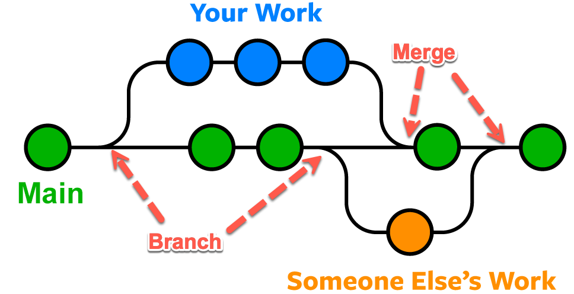
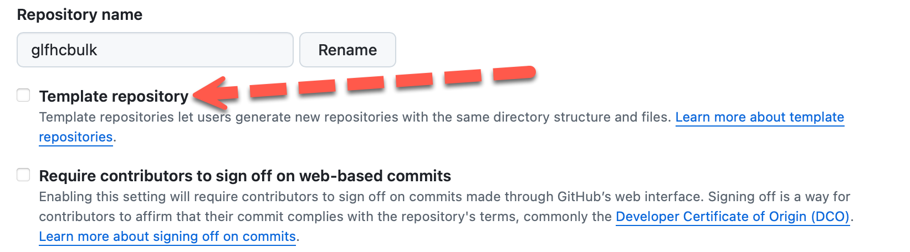

# GLFHC Forking and Branching guide

### [Henry Feldman, MD](mailto://hfeldman@glfhc.org)

## Forking and Branching

You will hear a lot of these 2 words when using git, and that is because it is the heart of how to get the most out of
it. Forking is taking a **copy** of an existing project to base your **new project** off of. At most larger dev
organizations they
have a common code library and this is the core of any new project so that is a repository you fork to your own project
and when doing so you can decide to fork it linked or unlinked. Linked means the changes to the original will be
propagated to your code (helpful) or unlinked means they will not automatically arrive (which may be important).
This depends on the type of project you are working on. Forking is done at the _start_ of any project. This allows you
to reuse code written by someone else. It also lets a group of projects get built identically (via templates which are basically
just repositories marked as templates, that normal users are only allowed to fork a copy for themselves). Forking can be hierarchical
so you can create a base GLFHC template that then has sub variants like GLFHC-SQL, GLFHC-Python, etc. 

Branching is something you **constantly** do. A branch is when you say, hey my code is working as is, and I would like
to stick a marker on this current state in case I break things, but I need to make a
major change and I don’t want to break the currently working version. After this we will use a concrete example. So you
make a branch which any change to a branch does not change the current version that is called “main”. In truth main is
just another branch, but it is the default one that is the “working version”. So when you create a repository it will
automatically have the main branch. When you change to a new branch, any change you check in stays in the branch. Later
when you feel your branch is the new working version you need to merge it back in (this is done confusingly via a “pull
request” (No the word “pull” makes no sense, but that’s what it is) when you perform the pull, it will presents
conflicts between the two branches. It is critically important to understand it has no idea about your code, so if you
decide at the top of your file to redefine a variable from string to integer it will show you the change to approve it
but that code could break something logically in your program. A true conflict is rare when editing code as a single
developer, it comes in more commonly when multiple developers change the same file and then the two versions of that
file are in conflict (in that example above, one changes the variable to integer the other to a double, you the merger
have to decide which wins out). These changes are ultimately merged in the main branch (at big tech companies they often
merge into yet another branch for testing and then and only then back to main, but these are large devops groups who can
take that extra load.

In the diagram above "Some Elses Work" can also be your own, as far as features you work on, so that you can seperate changes for s
safety, or can in fact be others. Any feature you want to be able to roll back through should be in a branch. Please name branches
something intellegent, so others understand what each branch does. The one branch name that is "sacred" is **main**. Main is the
default branch of all git projects. In complex multi-file projects branching is easier to visualize, when adding files, it makes sense
to carve those off, but even in a single file project, splitting into a branch makes it obvious where the milestones are.

For instance let's say you have a SQL script that is working great to generate an inventory report. Then someone says, oh, that report
is going to now join this whole other table over there into a sub query, with the columns reordered. Well the currently deployed version
is in the main branch, and in case we deploy the new version and discover some other tool depended on our output in ways
we hadn't anticipated, we might want to go back, or someone says "_Hey I just ran the new version of the report and noticed
we came up with a different number of widgets if I run it against a month ago under the old code_" This is where branches are 
super useful. So to start with we can instantly redeploy the old version (no horrible pile of .bck files to preserve old state) and during
debugging you can "diff" the branches and see where the differences are to see if you can spot the cause.

One common use for branches is experiment. You have code working for something, or at least to a place you need to decide how to 
procede. You can make branches for each alternative and when you find the one that works, you delete the others (or simply leave them
as explanation of your decision and just never merge them.)

## Using a Branch
When you create a branch git freezes your current branch (let's say for our example the branch is called "New_Inventory_Report") to understand what 
branch you are in, if you are in github desktop, the branch right now probably shows as "main" as seen here

If you select a different branch from this menu, the files in this directory will change, but don't worry nothing truly dissapeared,
think of this as a different select statement in a database, what records are visible is independent of the contents of the database.

## Merging (Pull Request) - i.e. unmerging
In the diagnram above, we see the the branches merging back into the main (green) branch. In git speak this is called a pull request (no it makes no
sense to me either) and the way it is used in the development world, is as a code review action. So you commit your changes to your 
branch and then file a pull request, depending on how the project is arranged, a pull request, (which gets rid of the branch and put the code back in 
main) can either happen automatically (as in there are no conflicts that a human needs to review) or there are changes that do conflict
(one piece of code references another that no longer is there). That will alert you that conflicts exist between the branches and the pull
needs to undergo conflict resolution. It is possible to tempted to simply force the merge overwriting the old branch with new 
code you just committed, but git sense a real conflict, an ignoring this is a risky action. Take a careful look at the conflicts
it find and decide the risk of each change.

## How to use a Pull Request
So once you have your branch all ready and tested, and no known issues, or at least issues that you have decided are OK to keep in
deployment, the first step in initiating the merging process is deciding where to merge your code into. By this I mean you can decide
what branch to merge into, yes, you can merge one branch into another. This mostly happens when you start a branch for a new feature
and that feature somehow is consumed into another feature before it completes. THis is more likely to happen in a multi-developer
team rather than single developer, since you need to keep everything seperate. The end pull will be into the main branch
which for purposes of merging is called the "head". It is much easier to create a pull request on the web interface, which you
select the branch menu at the top). Under that you will see all branches in the project. This feature only works if you have previously
branched (theoretically you can track changes without branching in which case there is no merging needed). However assuming we created
a banch that has changes, lets assume the branch is called "New_Inventory_Report"

Step 1 is to select the branch to merge **from**.
At the very top of the screen you see a yellow banner suggesting changes exist in a branch (implied that are not merged). It will look something like
this:

Next you need to select the destination branch (the base branch), in our case let's select merge into **Main**. Optionally if
there are no conflicts you can review the files. You should always do this step, first to verify the changes are what you expected, and to spot
any last minute mistakes. Remember conflicts are purely text editing conflicts not code level conflicts. It has no idea
that you said X is an integer and then 4 lines later treat it as a string, that is in your development environment's functionality (we will get to atuomatic validation in a bit). 
When you are presented with a conflict during this process you resolve them (important: when git (and other SCCS) identify conflicts they actually label them in the code (you will find >>> mine) or something
in your code. Those all have to be stripped since they are likely syntax errors in the code.) In large software
teams, typically a specific person is designated the only person permitted to perform a pull request, since the consequences 
of bad merging can break the entire team, in general you should do something similar within your group to make sure you don't
convince yourself that a conflict isn't important.

## Creating a template for my team
You have a perfect project you wish to create a template from, before that we need to understand what a template is and what it is used
for in a github context. A template is not the same as a common library or tool, it basically allows you to create a git repo
with the structure and features you wish from a generic project. This means if you want every project for a given team to be set up the same
way, including contents (you can include base code) this is a great way to set it up. This is a privileged function, which will help prevent
the chaos of everyone creating every template to the point nobody remembers what each one does. 

For all practical purposes a template has all the same features as a regular repository, including branches and everything else,
except that by being promoted to being a template it will be in the list of available templates when a user in the organization
creates their own new repository. 

- [create a repo](create_first_repo.md) like any other repo
- set up all the base features you want in your project (files, folders, etc)
- Commit and push the repo like any other.
- IN the web interface select setttings (the gear all the way to the right) select Template Repository

## Using a template to make a new repository
Using a repository template is almost easier than creating one, navigate into the template repository you want to use,
at the top right is a **Use This Template** drop-down and select "**Create a new repository**"

Suggested Next: [Automating Github](automation.md)