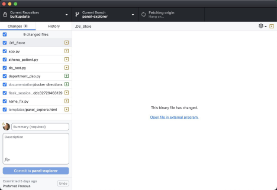

# GLFHC GitHub quick start guide

### [Henry Feldman, MD](mailto://hfeldman@glfhc.org)

This document is designed to give a quick overview on how to use GitHub to manage project files
to help development here at GLFHC. This document assumes some basic technical knowledge but not necessarily deep devops
knowledge. GitHub is a very complex environment and can do a lot! since this is a quick start it will not cover
everything that you might need, but there are _many, many_ online tutorials. We will start with a quick overview of what
git is and why use GitHub (and what _git_ vs. _github_ is), and I will attempt to de-mystify some of the strange terms
git
uses.

Note the majority of this is a cursory background on how it all works, and git is quite complex so worth a short read,
but if you are in a hurry or just need to remember how to get started skip to [actual workflow](workflow.md).

## What is git?

Git is a open-source source code control system, GitHub is an implementation of the git system currently owned by
Microsoft. There
is often confusion regarding GitHub versus git, but the difference is important as your computer will be running the
_git libraries_ while
connecting with _GitHub_. So while technically you can run git on your computer without github, most people
mean github.com when they say git, but it is slightly important to know the distinction.

### What do Source Code Control Systems do?

The basic explanation is it is a database that stores changes to files (
which may or may not be “code” - more on this later). So one analogy a lot of people use is the “track changes” in
Microsoft
word, or a public library (although that really is a poor analogy). But track changes rapidly becomes unmanageable when
you
have many editors of a document and Word does not worry if one
user clobbers another users content, and each one needs to wait while someone else edits that document, but having an
entire team operating in a serial fashion where each person waits on the person before is very inefficient. Other
editors such as google docs permit track changes across multiple simultaneous users, and anyone who has used this
feature knows how chaotic it gets as the screen is live updating and the text you’re editing is moving.

When writing executable code (whether SQL, python or Java it is very easy to make a conflicting edit (e.g. you
define a variable that your code depends on, and someone else deletes/changes the declaration – your code is now
broken, and you are confused).
This is where source control shines, as each person gets a copy of the project making changes on their private
local version not worrying too much of other's changes and only after check in (commit) do conflicts get resolved in
what every system other than git calls a **merge**, which we will talk about later.

For those familiar with databases, almost all databases permit many users to simultaneously connect to a single
database, but typically writes are exclusive and atomic so only one person may write to a _given record_ and the last
write wins. For
example Sophia and Maria are both editing a patient’s address, let’s say Maria clicks **save** first, the record is
updated
to her edits, but Sophia then saves her edits, the database now will show Sophia’s edits overwriting Maria’s. That works
reasonably well for databases (and there are schemes outside the scope here that try to prevent this issue) but would be
a terrible way to manage code as code often depends on other code. So, if databases worked like git, and they were both
editing a
document holding the patient’s demographics they would each
edit the document and commit their changes to git if the edits don' conflict in any way, they are merged together as the
changes are
independent, if there is a conflict the person doing the merge determines the safe final state. In our example we can
pretend Sophia misspelled the
street but has the right number while Maria did the reverse, so during merge he selects Sophia’s house number and
Maria’s street name to go into the final version. Enough analogies, let's get down to actual github:

### How do I use git/github on my computer?

GitHub works by having a local version of git repository (essentially copy of the database) on your computer by checking
out (“cloning” in git
speak) a copy of the project that is on the github server. Your local copy of git manages your change tracking and when
you commit (same as database commits) your changes in your local copy and can then push the list of changes up to github
so that others see it with a
comment as to what your changes were for. Github does not understand the content you pushed, just what is different from
the
prior version, this isn't quite true, and there are a gajillion tools you can add to git to make it understand content,
but for now
let's have that premise.

To make this all happen you need to install git onto your computer, and on many modern operating systems it is pre
installed (on MacOS if you install Xcode [free] it will auto install git the first time your run it). On Linux it is
probably
preinstalled (if unsure open a terminal window and simply type git —version), windows may or may not have it installed.
Most modern IDEs (development environments) such as [visual studio code](https://code.visualstudio.com)
or [eclipse](https://www.eclipse.org) have built in git support and may
install the client for you. Now you probably don’t want the command line git client for daily work (it is very powerful
but obtuse), so what you probably want to install is the [GitHub desktop](https://github.com/apps/desktop) tool which
you get on GitHub.com (free), and you
want this even if you use the client in your IDE, I strongly recommend you get this tool, as it provides a very clear
preview of the state of your changes and ability to see conflicts better than most IDEs do. You will also need to make a
GitHub account if you want to put your data on GitHub (note you can use Git on your computer yourself to manage your
code alone, but that is not what this tutorial is about)

Once you have a GitHub account you enter that information into the GitHub desktop (and your IDE if you wish). Now you
will see a window that looks something like this:

there are several key parts of this screen, first is the top in black has 3 boxes, the first has the name of the current
repository (directory with your files) and if you have multiples that is where you can switch, next block is the current
branch (more later) and finally the fetch/push to origin button. Click the fetch origin button and it should sync your
account (if it fails you might not have your account info correct)

There is “proper” way to set up your machine, and what most people do is create a directory in your home directory (or
somewhere you remember) with a name such as “/gitclones” this will be the place where all your managed repositories live
when git is managing them; you can have them anywhere, but trust me you want them in a folder. If you have existing
projects we will get to that in a moment, leave them where they are for a bit.

## Next
View [Creating your First Repo Tutorial](create_first_repo.md)