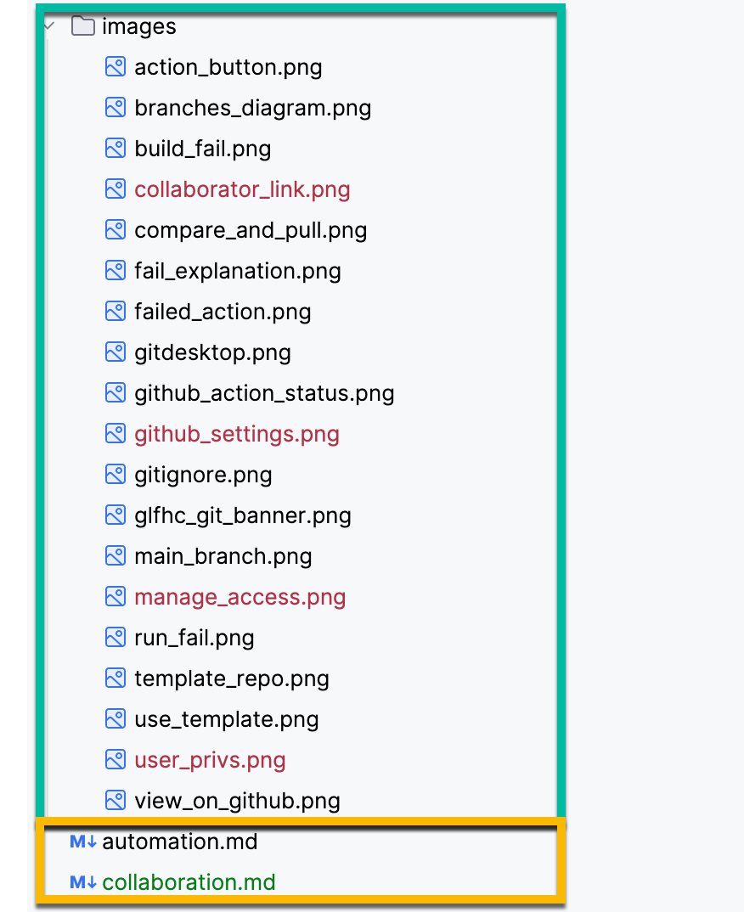
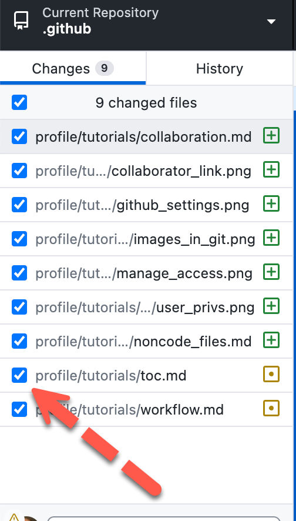
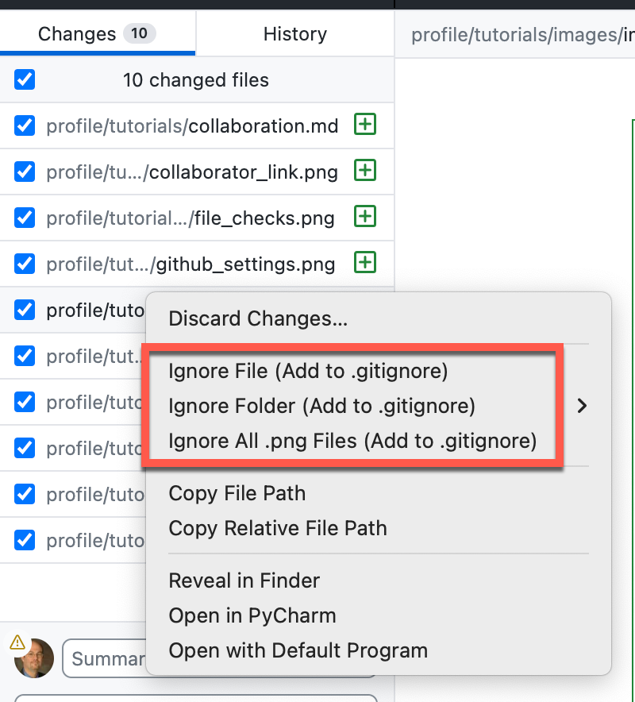

# Managing Non-Code Files in GitHub

## What Non-Code Files Means
Most people think of a Source Code Control System, as well, managing source code, but in reality
it is simply a database of files and their changes. Unlike say SQL Server, Git is more than happy to
maintain the differences between binary files such as images, documents, etc. That doesn't mean Git understands
those changes, like it can with code, so unlike say a SQL file where GitHUb would display the changes from
a specific commit, with a JPEG file it will simply show the time/date and comment that were changed.

## Can I Manage Any File in my Repository?
Technically yes, in reality some common sense needs to prevail. Yes, any file that can live on your file system
can be monitored by Git, _however_ GitHub is obviously not interested in hosting your 12GB feature film length
video file on their disks. And if you check in a file over their file limit, they put restrictions on what you can do
with the repository after that. Far better to put that file in say Vimeo and put a link to it in the README.

### Binary Files That You Should Manage
As a general rule I put any Word, Excel or PowerPoint documents in Git that belong to the project. So if you gave a presentation
on the basis for a given project, please put that in, this lets any user curious as to why a project is the way it is
to view the same content. 

Also, any critical Excel, PowerPoint or Word files that are critical to the business should be under source control, even
if unrelated to a coding project. Why? Well just like track changes in office application, Git provides a far more robust
change tracking and even more important a rollback feature (which works just fine on binary documents as it simply stores 
copies with each commit). Think of this as the way Athena tracks data in the database with the MDTermDate for each obsolete version
of an object. And even if your laptop falls in the Lawrence river the organization has the current copy. Additionally, if someone
else is going to modify the document, the usual passing around a Word file and naming it with the user who modified,
just feels like we are back in the Floppy Disk era. With GitHub no need change the name, as we see the name of who made each commit.

### Using Binary Documents in Markdown in the Repository
You can link to managed binary files like images easily in your Markdown documents like we do in the tutorials:

As we see here, this tutorial project includes lots of [PNG](https://en.wikipedia.org/wiki/PNG) file graphics that I 
then reference in the Markdown text. The green box is a folder with the images, and then the yellow box has Markdown
files that reference some of them. The references can also be to documents such as Office files.

### Binary Files related to Code, You Don't Want
As anyone who has worked with any development tools knows, your folder rapidly gets filled with all sorts of tiny binary files,
such as cache files, compiled code (depending on the DBMS even SQL can be precompiled), IDE settings,
etc. You probably don't want to check these in as they will potentially override a collaborator's

### Ignoring those Unwanted Files
In a repository the special file ".gitignore" is as the name implies the list of file types that git will simply ignore,
when you add a file to this list, git will no longer track it. However (there is always a however!) if you have already committed
a file into GitHub, you cannot ignore it (not even sure what that would mean?). If you have done so, you can sometimes delete the 
file, commit the deletion and then add it to the ignore list. The ignore list can contain directories as well as files, so for
instance in java projects, you would of course ignore your keystore folder (please, never ever check in keys!) and rather than
worry about each time Java dumps a cert file in the keystore, just ignore the entire directory. You can also ignore a file type
(so for python one would typically ignore all _*.pyc_ file - python compiled). Why should we ignore compiled files? Well
they might be platform or machine specific compilations (say Intel vs. ARM) which will confuse the other person. Plus they take
a lot of space.

### Auto-ignoring Unwanted Files
Since this is such a common problem, GitHub has prebuilt ignore files, that when you create a a repository you can select an
ignore template (not the same as a repository template) which has the most commonly ignored files in that language's repositories.
It's not perfect, but gets 90% of the noise out of the process. You can modify it once the repository is created.

### Manual Ignore a File For This Commit
This is much, much easier via the GitHub Desktop (or some other GUI tool), when you look in the desktop, **BEFORE** you select commit
you notice checkboxes to the left. 

If for some reason you don't want to check something in for the moment (like you are doing an update
that will break everything until you are done, but need to check in something for another person to start their work), just
uncheck that file before comitting. 

### Automatic Adding to Ignore List
If you want to keep it permanently not checked in, right click and add to the ignore file. You can select the specific
file, the folder or the file type.

### MS Office Intermediate Files
It is a good idea if you are working in MS office on a Git managed document, you probably have seen that Office often has a
binary intermediate file (before you save) which begins with a tilde and a dollar sign as in **~$sting open.docx**. You probably
want to add all files beginning with '~$' to prevent these open files (which are unusable from being seen by Git). 

### Binary Document Actions
For various Document formats you can use them in your Actions for either validation or data to run the script itself.
For documents other than Excel, Pandoc is useful for parsing documents of various formats and converting one to another.
For instance converting a DOCX Word document to a text file allows easy parsing of the contents to drive part of the validation
process in your Actions. I don't know a specific use for this, but for instance a document that proposes a specific schema,
can then be used to validate against that schema's properties.

